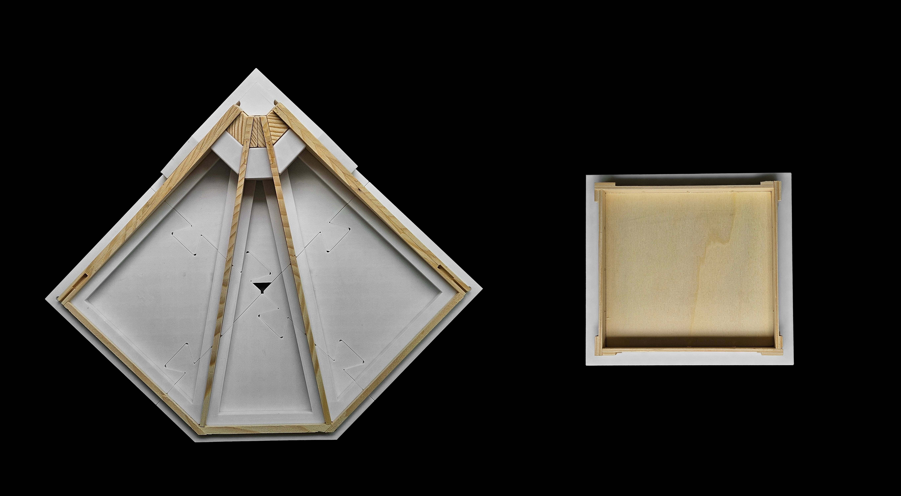

---
hide:
  - toc
---

# Assembly

<!-- One section per assembly step: a title, a 3D viewer, a description of what
     happens on site. No tables - the part list already carries the numbers;
     this page carries the sequence.

     Each viewer loads the coloured preview an `examples/example_model_23_assembly_*`
     script writes to `data/assembly/`, published at `_models/` by
     hooks/fabrication_assets.py. Two files are named per viewer, the OBJ and
     its MTL: Online 3D Viewer only fetches what it is handed, and without the
     MTL every part comes out the same grey. Drag to orbit, click to open the
     step full size. -->

## Step 1 &mdash; Build the quarters and the oculus in a jig

<!-- The shop, before anything reaches the slab. Both pieces are solid: neither
     is context for the other. Same wide-bay wrapper as the site steps. -->

Each quarter is built **upside down** in a jig, and the oculus in one of its
own beside it. The face that becomes the soffit points at the ceiling of the
shop, so the beds go on downhand, onto ribs already standing on their top edges.

**In total**

--8<-- "data/assembly/assembly_step1_points.md:totals"

## Step 2 &mdash; Set out the column bases (Sherpa Power Base 150402_PB_L-140-C)

<!-- The `camera` is not optional here: without one, Online 3D Viewer falls back
     to its own Y-up default and lays the building on its side. The last three
     numbers are the up vector - `0,0,1` for every model in this repo.

     This used to be a close-up of support_0 with the tripod behind it, from
     0.7 m out. It cannot be any more: the session now stakes out the tower legs
     in the middle as well as the four bases at the corners, so the shot has to
     hold the whole floor - station in the middle, beams reaching out to every
     mark. Same wide-bay treatment as steps 4 and 5: the `viewer-bay` wrapper
     does the zooming, the camera only sets the direction.

     Edges are ON and BLACK (`on,<r>,<g>,<b>,<threshold>`), same as step 3.
     They had to be off while the parts were meshes - every facet of the beams
     and the balls got outlined. Now the parts are Breps tessellated low-poly,
     ~13 segments round a circle, so neighbouring facets differ by ~28 degrees
     and the 45 degree threshold passes straight over them. Only real edges
     draw. The total station is the exception: it is a downloaded triangle
     mesh, so it carries more lines than the parts do. -->

<!-- The photo carries the same colour key as the viewer above it: the dots are
     absolutely positioned in per cent of the image, so they ride along with it
     at any width. Colours are the BLUE/PINK of
     examples/example_model_23_assembly_step2.py. -->

  
  
  
  
  
  
  
  
  

[SHERPA Power Base L 140 C][sherpa-pb-l140c]

- **4 bolts down** M12 anchors, 100 mm into the slab
- **3 screws up** SHERPA 8 x 180 mm, into the column end
- **Blue** &mdash; the 4 bolt holes under each power base
- **Pink** &mdash; the 4 corners of each base plate

<!-- Only the coordinate lists are generated (by
     examples/example_model_23_assembly_step2.py, pulled in by section name).
     The headings and the note under them are prose - edit them here. -->

**Bolt holes to mark (blue)**

--8<-- "data/assembly/assembly_step2_points.md:holes"

**Base plate corners to measure (pink)**

--8<-- "data/assembly/assembly_step2_points.md:corners"

**Tower legs to mark (blue centre, pink plate)**

A 1500 &times; 1520 mm rectangle, diagonals equal to 0.000 mm.

--8<-- "data/assembly/assembly_step2_points.md:tower"

All at `z = 0`, in millimetres on the building grid.

[Assembly instructions (PDF)][sherpa-pb-c-manual] &middot;
[video][sherpa-pb-video]

  [sherpa-pb-l140c]: https://www.sherpa-connector.com/en/produkte/power-base/power-base-c/3391_306_shop_SHERPA-Power-Base-L-140-C.aspx?LNG=en
  [sherpa-pb-c-manual]: https://www.harrer.at/data/db/072017_SHERPA_Montageanleitung_PB_C.pdf
  [sherpa-pb-video]: https://www.youtube.com/watch?v=jxFHtDUMXdI

## Step 3 &mdash; Screw the connector heads onto the columns

<!-- `camera` carries the up vector, as in step 2. Edges are ON here and BLACK
     (`on,<r>,<g>,<b>,<threshold>`): nothing is coloured in this step, so the
     edges are what separate the column, the plate and the screws. The 45
     degree threshold leaves the 64-facet plate smooth - 5.6 degrees a facet -
     and only draws where the part really has an edge. -->

**Per column**

--8<-- "data/assembly/assembly_step3_points.md:spec"

**In total**

--8<-- "data/assembly/assembly_step3_points.md:totals"

## Step 4 &mdash; Stand the columns on the bases

<!-- `camera` here sets the DIRECTION and the up vector only: Online 3D Viewer
     fits the bounding sphere to the box on load, so whatever distance the eye
     is given is thrown away. Looking down the diagonal of the grid from a
     corner puts all four columns in the frame without one hiding another.

     The eye looks DOWN the diagonal at about 30 degrees, so the four bases
     read as a square - which is what the step is about - and no column hides
     another. Steeper than this and the slow orbit the viewers run starts
     swinging the bay out of the frame; 30 degrees stays centred all the way
     round.

     Zooming in is the `viewer-bay` wrapper, not the camera - see assets/extra.css.
     This is the first shot of the whole bay rather than one part, and in the
     wide box of the other steps a sphere that size comes out tiny.

     Edges ON and BLACK, 45 degree threshold - same reasoning as step 2. -->

Each column is set down on the base its head plate was screwed into in step 3.
The coupling nut joins the two halves and the 150 &ndash; 200 mm adjustment
takes up the level. Columns are ghosted, so the screws and anchors show.

**Which column on which base**

--8<-- "data/assembly/assembly_step4_points.md:seating"

**In total**

--8<-- "data/assembly/assembly_step4_points.md:totals"

## Step 5 &mdash; Prop the columns and stand the tower

<!-- Same wide-bay treatment as step 4: the `viewer-bay` wrapper does the
     zooming (Online 3D Viewer fits the model when it loads), and the camera
     sets the direction - about 30 degrees above the diagonal. This model is
     wider than step 4's, since the prop feet stand 2.5 m out from every
     column, so the eye is further back again. -->

Before the floor goes up, the columns are propped and a tower goes up in the
middle:

- **8 raking props** &mdash; two per column at 45&deg;, clamped at `z = 2500`,
  base plates 2586 mm away along the slab
- **1 tower** at the centre, top at `z = 3303` &mdash; 197 mm under the column
  tops, deck inside the oculus opening

The tower stands on its four leg marks from step 2. The props need no marks.

**In total**

--8<-- "data/assembly/assembly_step5_points.md:totals"

## Step 6 &mdash; Land the first quarter

<!-- Steps 6 to 8 build the floor up one set of parts at a time: what is already
     standing is ghosted, what this step adds is solid. Same wide-bay wrapper
     and 30-degree diagonal as steps 4 and 5. -->

The first quarter goes on with the two steel plates that tie it into the column
head, and their dowels. Columns and bases are ghosted.

**In total**

--8<-- "data/assembly/assembly_step6_points.md:totals"

**Dowels, in the plate's own frame**

--8<-- "data/assembly/assembly_step6_points.md:dowels"

## Step 7 &mdash; The other three quarters

The remaining three quarters, each with its own pair of steel plates and dowels.
The four seams between quarters close as they land, and an outer-rib connector
ties each one.

**In total**

--8<-- "data/assembly/assembly_step7_points.md:totals"

**Seams**

--8<-- "data/assembly/assembly_step7_points.md:seams"

## Step 8 &mdash; Close the oculus

The ring goes in last of the floor parts, off the tower deck standing under it.

**In total**

--8<-- "data/assembly/assembly_step8_points.md:totals"

**Where each quarter meets the ring**

--8<-- "data/assembly/assembly_step8_points.md:ring"

## Step 9 &mdash; Drive the wedges

The wedges lock the seams and the oculus, each held by its own screws. The floor
is ghosted so the wedges and screws read.

**In total**

--8<-- "data/assembly/assembly_step9_points.md:totals"

**Each wedge**

--8<-- "data/assembly/assembly_step9_points.md:wedges"

