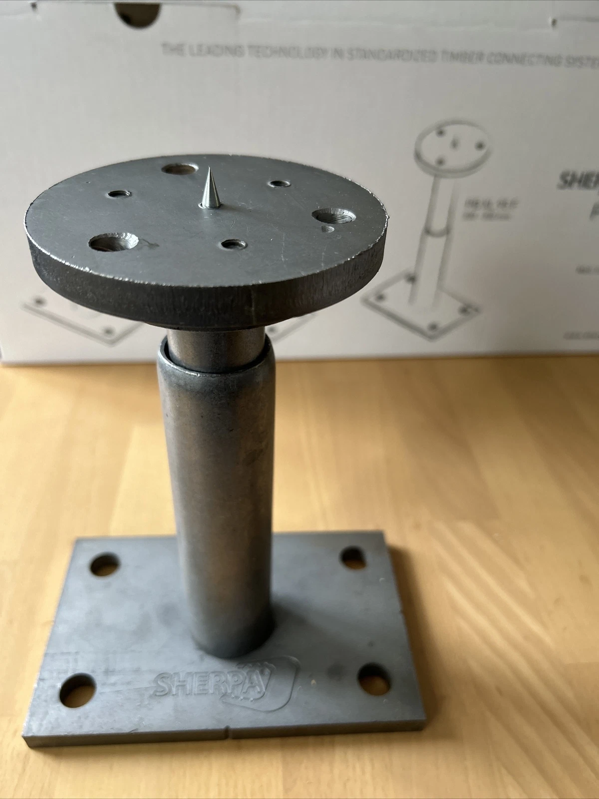

---
hide:
  - toc
---

# Assembly

<!-- One section per assembly step: a title, a 3D viewer, a description of what
     happens on site. No tables - the part list already carries the numbers;
     this page carries the sequence.

     Each viewer loads the coloured preview an `examples/example_model_23_assembly_*`
     script writes to `data/assembly/`, published at `_models/` by
     hooks/fabrication_assets.py. Two files are named per viewer, the OBJ and
     its MTL: Online 3D Viewer only fetches what it is handed, and without the
     MTL every part comes out the same grey. Drag to orbit, click to open the
     step full size. -->

## Step 1 &mdash; Set out the column bases (Sherpa Power Base 150402_PB_L-140-C)

<!-- The `camera` is not optional here: without one, Online 3D Viewer falls back
     to its own Y-up default and lays the building on its side. The last three
     numbers are the up vector - `0,0,1` for every model in this repo. The shot
     is aimed AT support_0, from 0.7 m out and 0.26 m up: the support fills
     about a quarter of the frame and the tripod legs rise behind it.

     Eye height is the dial that trades the two subjects off, and the trade is
     steep. Centring on something 0.7 m away puts a 1.7 m object 5 m behind it
     at the very edge of the 45 degree field, so every 100 mm of extra height
     costs roughly 7 degrees of the station: at z=100 all of it is in frame and
     the view is flat; at this z=260 the legs show and the head is cropped;
     much above that and the station is gone altogether.

     Edges are ON and BLACK (`on,<r>,<g>,<b>,<threshold>`), same as step 2.
     They had to be off while the parts were meshes - every facet of the beams
     and the balls got outlined. Now the parts are Breps tessellated low-poly,
     ~13 segments round a circle, so neighbouring facets differ by ~28 degrees
     and the 45 degree threshold passes straight over them. Only real edges
     draw. The total station is the exception: it is a downloaded triangle
     mesh, so it carries more lines than the parts do. -->

**Blue** are the four bolt holes under each power base,
**pink** are the four corners of each base plate.

<figure markdown="span">
  { width="320" }
  <figcaption>
    The connector the points are set out for: a SHERPA Power Base L 140 C. The
    140 x 140 mm base plate takes <b>four</b> anchors into the slab - those are
    the blue points. The &Oslash;106 head plate takes <b>three</b> angled SHERPA
    8 x 180 screws up into the column, and the spike in its middle centres the
    plate on the column's end face.
    <a href="https://www.youtube.com/watch?v=jxFHtDUMXdI">Sherpa Connector Power
    Base for Post Supports</a> shows the sequence.
  </figcaption>
</figure>

--8<-- "data/assembly/assembly_step1_points.md"

## Step 2 &mdash; Screw the connector heads onto the columns

<!-- `camera` carries the up vector, as in step 1. Edges are ON here and BLACK
     (`on,<r>,<g>,<b>,<threshold>`): nothing is coloured in this step, so the
     edges are what separate the column, the plate and the screws. The 45
     degree threshold leaves the 64-facet plate smooth - 5.6 degrees a facet -
     and only draws where the part really has an edge. -->

A Power Base comes apart at its coupling nut. The half with the base plate
stays anchored in the slab from step 1; the half with the cone and the head
plate goes onto the column first &mdash; flat on trestles, where three screws can
be driven into the end grain comfortably and squarely, instead of overhead on a
standing column.

The head plate is **let into the column end**, not butted against it: a
&Oslash; 106 x 12 mm pocket is machined in the end grain and the plate sits in
it, which is what the datasheet asks for and what keeps water off the joint.
The plate is drawn inside the timber for that reason &mdash; the overlap is the
pocket. The columns are **ghosted** so the plate and the three screws show
through them.

--8<-- "data/assembly/assembly_step2_points.md"

