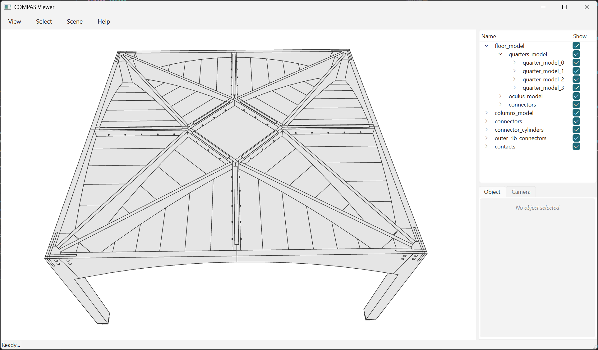

# Read the model

`compas.json_load` gives back the whole thing: elements, features, materials,
the tree, and the graph with the contacts on it.


/// caption
237 elements, 733 contacts. The scene tree on the right is the model's own tree,
mirrored, so every group can be switched off on its own.
///

```python
--8<-- "examples/example_model_19_read_model.py"
```

```text
237 elements, 733 contacts
```

The geometry is **baked** - every boolean already evaluated and stored - so this
runs none and needs no boolean backend: 0.60 s for 3.9 MB.

What the 237 are:

```text
floor_model              185    quarters_model 136 = 4 x 34
                                oculus_model     9
                                connectors      40
columns_model              8    4 x (column + support)
connectors                 8
connector_cylinders       32
outer_rib_connectors       4
```

A quarter is 34: 18 beds, 6 t-sections, 2 outer ribs, 2 inner ribs, 3 inner
beams, 3 wedges. 145 of the 237 are `PlateElement`; the rest are the columns,
their supports, and the fasteners.

`model.elements()` yields the groups too, `geometry_elements()` only the leaves.
`model.contacts()` reads what the search stored rather than searching again.
