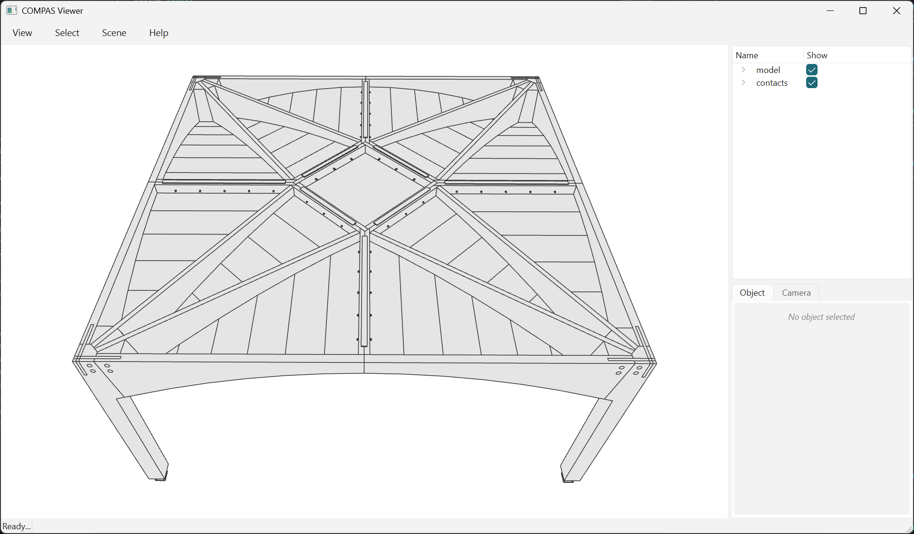

# Read the Breps

The STEP file is the same geometry with no compas_tf concepts in it: solids, the
way a shop gets them.


/// caption
237 solids, 19.5 MB, no compas_tf needed to open it. Compare the scene tree with
the page before: two flat entries. STEP carries no names and no hierarchy, so
there is nothing to mirror.
///

```python
--8<-- "examples/example_model_20_read_brep.py"
```

```text
237 solids, 4779 faces, 733 contacts
```

The model is one compound, so `.solids` splits out the parts. The contacts are a
second file: they are loose faces, which `.solids` would drop. Coplanar faces
were merged before writing, so 13730 mesh faces come back as 4779 Brep faces,
each drilled face carrying its hole loops.

**Set the deflection.** At the `0.001` default the building tessellates to 2.93M
triangles in 67 s; at `1.0` it is 19.8k in 2.0 s, same picture.

**STEP drops names.** Every face reads back unnamed, so this page can draw the
contacts but not say what they join. Order survives, and the sidecar uses it -
see [the next page](025_read_brep_adjacency.md).
