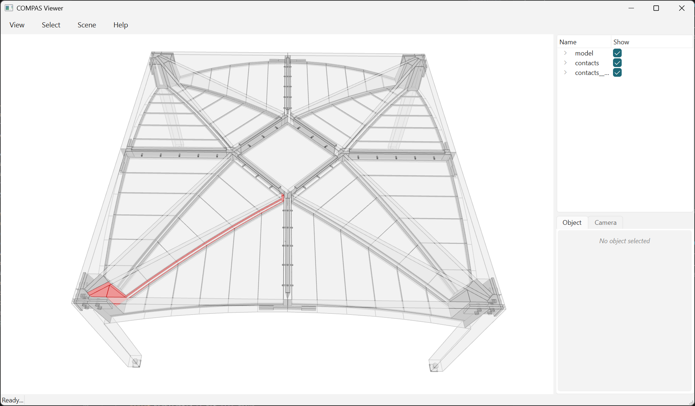

# Read the Breps with their adjacency

The page before this draws the STEP files. This one asks them what is connected
to what, which needs the third file: the JSON sidecar written beside the contact
STEP.


/// caption
The 17 contacts on `inner_ribs_0_0` picked out in red, the rest of the building
ghosted behind them. The solids come from the STEP, which knows no names - the
sidecar is what turns "face 412" into "this rib meets that bed".
///

```python
--8<-- "examples/example_model_22_read_brep_adjacency.py"
```

```text
237 solids, 733 contact faces, 733 adjacency records
169 elements over 585 pairs, 20.92 m2 of interface

biggest joints:
   0.344 m2  inner_beams_0_1 - connector_wedge_3  (3 faces)
   0.344 m2  inner_beams_2_2 - connector_wedge_3  (3 faces)
   0.344 m2  inner_beams_0_0 - connector_wedge_0  (3 faces)
   0.344 m2  inner_beams_2_1 - connector_wedge_0  (3 faces)
   0.344 m2  inner_beams_0_2 - connector_wedge_5  (3 faces)

most connected:
   17 neighbours  inner_ribs_0_0
   17 neighbours  inner_ribs_1_0
   17 neighbours  inner_ribs_0_1
   17 neighbours  inner_ribs_1_1
   17 neighbours  inner_ribs_0_2

by type:
  12.818 m2  PlateElement - PlateElement
   4.459 m2  ConnectorWedgeElement - PlateElement
   1.106 m2  ColumnElement - PlateElement
   1.101 m2  ConnectorElement - PlateElement
   0.895 m2  ColumnElement - ConnectorElement
   0.541 m2  OuterRibConnectorElement - PlateElement

highlighting 17 contacts on inner_ribs_0_0
```

Three files, no `compas_tf` model: solids, loose planar faces, and a list of
records. Nothing is deserialized into elements, so this runs anywhere OCC does.

## Index is the only join

STEP drops the per-shape name, so the 733 faces read back unnamed - but it
preserves their **order**, and both files come out of the same
`contact_pairs` walk. Record *i* therefore describes face *i*, and
`zip(records, faces)` is the whole mapping:

```python
{"index": 0, "a": "beds_0_0_0", "b": "wedges_inner_beams_0_0",
 "a_type": "PlateElement", "b_type": "PlateElement",
 "a_guid": "c46c8acc-...", "b_guid": "3098146e-...",
 "area": 39851.67}
```

Which is also why the example refuses to continue when the two counts disagree.
An index join has no way to notice it is wrong: pair a 733-face STEP with a
sidecar from a different run and every name lands on the wrong face, silently.
The count is the one check available, so make it.

## The names are element names, not solids

The adjacency is a graph over *names*. The model STEP is anonymous the same way
the contact STEP is, so nothing here can say which of the 237 solids is
`beds_0_0_0` - the sidecar only describes the contact faces. Connectivity, areas
and a highlighted joint come out of these three files; geometry attached to a
name does not. For that, read the JSON model instead, where the elements survive
with their names, tree and graph.

## A pair is not a face

585 pairs carry 733 faces, so some elements meet over more than one: an L-shaped
interface a planar contact cannot express in one loop, or two parts that
genuinely touch in two places. Group by `(a, b)` before ranking anything, or one
joint split in three is counted as three small joints and sorts below a single
big one.

The type table is the same grouping one level up and is the fastest read on what
carries what: plate-to-plate is 12.8 of the 20.9 m2, and the fasteners' own
share is what the contact search was told to skip on the way in
(`skip=involving(DowelCylinderElement, ConnectorCylinderElement)`) - a faceted
shaft touches its hole once per facet.
