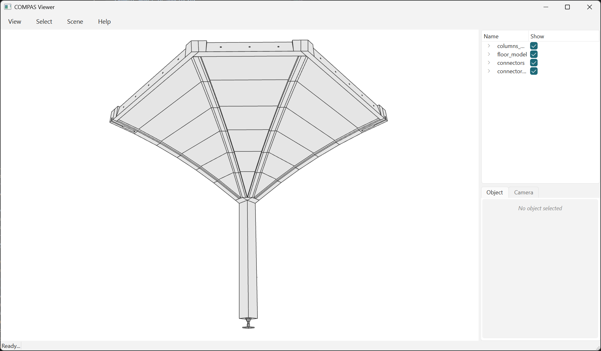

# Extract one column and one cantilever

Any named group can be lifted out as a model of its own. One column plus the
cantilever it carries is the unit that gets assembled on site.


/// caption
The 46 elements that make a bay, and nothing else - cut off along the seams
where the next quarters would begin.
///

```python
--8<-- "examples/example_model_21_extract_bay.py"
```

```text
bay_0: 46 of 237 elements, 143 of 733 contacts
    34 of  145  PlateElement
     8 of   32  DowelCylinderElement
     2 of    8  ConnectorElement
     1 of    4  SupportElement
     1 of    4  ColumnElement
columns_model  (2 parts)
  column_model_0  (2 parts)
floor_model  (34 parts)
  quarters_model  (34 parts)
    quarter_model_0  (34 parts)
      beds_0  (18 parts)
        beds_0_0  (6 parts)
        beds_1_0  (6 parts)
        beds_2_0  (6 parts)
      tsections_0  (6 parts)
      outer_ribs_0  (2 parts)
      inner_ribs_0  (2 parts)
      wedges_inner_beams_0  (3 parts)
      inner_beams_0  (3 parts)
connectors  (2 parts)
connector_cylinders  (8 parts)
```

Every group keeps its place, so the bay is the same tree pruned to what it
contains, not a bag of parts. The copy is independent - fresh guids - and writes
to JSON or STEP like any other model.

**Both groups in one call.** The contacts *between* the column and its
cantilever survive only if the two come out together; extracting each on its own
and merging drops exactly that joint.

**`neighbors=` takes types, not `True`.** The fasteners live in top-level groups
holding all four bays' hardware, so they cannot be named - `neighbors=` finds
this bay's own, by contact for the connectors and by bounding box for the dowels,
which the contact search skipped and which therefore have no graph edge.

```text
neighbors=False        36 elements, 125 contacts
neighbors=FASTENERS    46 elements, 143 contacts
neighbors=True         77 elements, 208 contacts
```

`True` admits anything that touches: four plates from the quarters next door,
two oculus plates, and then `connector_wedge_7`'s cylinders, whose boxes overlap
one of those oculus plates. Naming the types stops that at the first step.

The groups you can name:

```text
floor_model                    185 parts
  quarters_model               136
    quarter_model_0 .. _3       34 each
      beds_0, tsections_0, outer_ribs_0, inner_ribs_0,
      wedges_inner_beams_0, inner_beams_0
  oculus_model                   9
  connectors                    40
columns_model                    8
  column_model_0 .. _3           2 each
connectors                       8
connector_cylinders             32
outer_rib_connectors             4
```

A name that matches nothing raises `ModelElementNotFound`.
