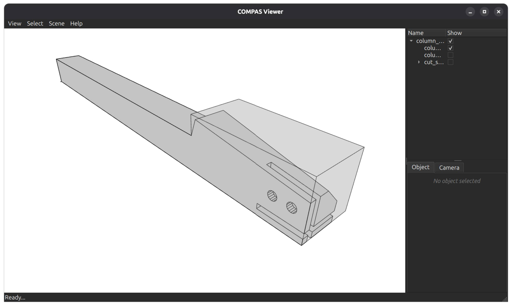

---
hide:
  - toc
---

# Part list for fabrication

| Part | Qty | Image | Files | Dimensions (mm) | Material | Notes |
| --- | ---: | --- | --- | --- | --- | --- |
| Outer rib | 8 | | | 2750-2783 x 695-745 x 100 | | Two per quarter; joined across the seam by TF-12 |
| Inner rib | 8 | | | 3264-3304 x 695-707 x 60 | | Two per quarter |
| Inner beam | 12 | | | 1365-1984 x 197-203 x 60-77 | | Three per quarter |
| Inner beam wedge | 12 | | | 648-650 x 243-300 x 172-240 | | One under each inner beam |
| T-section | 24 | | | 2669-3229 x 143-151 x 27 | | Six per quarter |
| Bed | 72 | | | 521-1875 x 314-516 x 27 | | Eighteen per quarter, in three rows |
| Oculus plate | 9 | | | 1267-1354 x 27-1294 x 27-60 | | Centre ring, one set for the bay |
| Column | 4 |  | [STEP](https://github.com/BRG-research/compas_tf/raw/main/data/fabrication/column_0_fab.stp) · [OBJ](https://github.com/BRG-research/compas_tf/raw/main/data/fabrication/column_0_fab.obj) | Column 220 x 220 x 2850 (with the capitel height), Capitel 340 x 340 x 730 | Spruce | Square section, with gluing 3 pieces for the column-head  |
| Column base | 4 | | | 150 x 140 x 140 | Steel | Sherpa Power Base 150402_PB_L-140-C; head plate D106 x 12, base plate 140 x 140 x 12, 4 x D15 |
| Column-rib connector | 8 | | | 485 x 250 x 30 | | Two per column, straddling the column-rib contact |
| Contact wedge | 8 | | | 1039-1699 x 211 x 63 | | Along the quarter-to-quarter seams |
| Outer rib connector | 4 | | | 800 x 70 x 40 | | Fixed shape from `data/OuterRibConnector/*.obj` |
| Dowel, column side | 16 | | | 100 x D49 | | Four per column |
| Dowel, rib side | 16 | | | 100 x D49 | | Four per column |
| Wedge dowel | 32 | | | 160 x D18 | | Three to five per contact wedge |

## Column - `examples/example_model_12_fab_column.py`.

