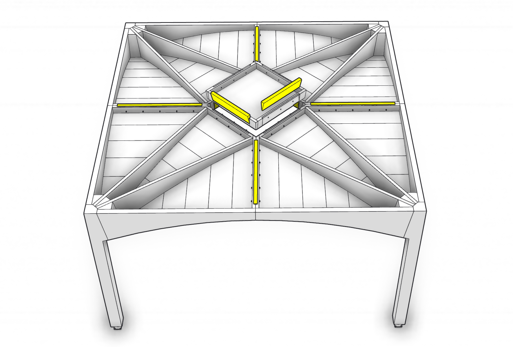

# compas_tf

`compas_tf` builds the timber floor as a parametric model - columns, ribs, beds,
t-sections, the oculus and the connectors - every element boolean-cut and
contact-checked. The finished model is written as JSON and as STEP.

/// caption
One bay: four quarters of ribs, beds and t-sections on a column, an oculus at
the centre, and the connectors in yellow.
///

[**The presentation**](https://docs.google.com/presentation/d/1b6M9fYuQjmKMM1xWZPiqj3Y3arJCszfi/edit?slide=id.p1#slide=id.p1)
- the whole project.

[**The model as STEP**](https://github.com/BRG-research/compas_tf/raw/main/data/cantilevers_baked_model.stp)
- 237 solids, 20 MB, no `compas_tf` needed. Also as
[JSON](https://github.com/BRG-research/compas_tf/raw/main/data/cantilevers_baked_model.json),
which keeps the names, the tree and the contacts.

Reading a finished model needs nothing but `compas_tf` - start with the
[examples](examples/010_read_model.md).
